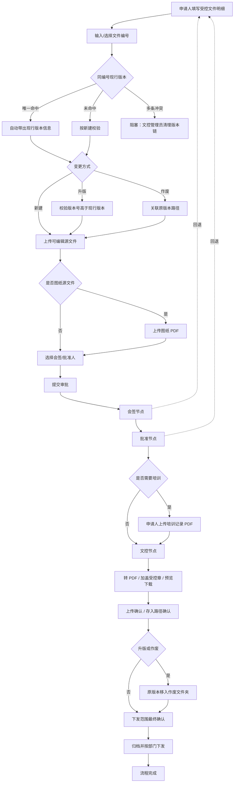

# 电子文控系统受控文件上传流程 PRD

## Purpose and Scope

本文定义电子文控系统“受控文件上传审批”一版产品范围，重点覆盖申请人上传源文件、同文件编号现行版本自动关联、审批流转、培训记录补传、文控受控版本确认、原版本作废处理、文件下发范围按部门勾选。

本 PRD 是后续 BDD 场景、严格 TDD 开发计划、真实 E2E 验收的业务依据；不包含代码实现，不替代系统设计和数据库迁移评审。

## Evidence Reviewed

- 原始 Excel：`C:\Users\BJB110\Desktop\文档\电子文控系统推进计划及需求表.xlsx`。
- Excel 证据范围：`推进计划!A3:E8`、`需求!C2:R20`、`需求!I18:I21`。
- 用户补充：填写受控文件明细时，应自动关联同一文件编号的现行版本信息；文件下发范围应支持按部门勾选。
- 当前前端入口：`yudao-ui-admin-vue3/src/views/dcc/controlled-file/upload/index.vue` 已存在受控文件提交页、历史文件名建议、可编辑源文件上传、图纸 PDF 上传、审批路线预览。
- 当前前端提交模型：`yudao-ui-admin-vue3/src/views/dcc/controlled-file/upload/submitter.ts` 已包含 `fileNumber`、`versionNo`、`needTraining`、`selectedSignoffUserIds`、`drawingPdfUploadTicket`。
- 当前后端提交接口：`ruoyi-vue-pro/yudao-module-dcc/src/main/java/cn/iocoder/yudao/module/dcc/controller/admin/file/DccControlledFileController.java` 已提供 `/dcc/controlled-files/submit`、`/upload-preview`、`/route-preview`、`/upload-name-options`、`/upload-directory-tree`。
- 当前数据基础：`ruoyi-vue-pro/sql/mysql/20260513_dcc_base_schema.sql` 已包含 `dcc_controlled_file`、`dcc_controlled_file_master`、`dcc_controlled_file_distribution`、`dcc_controlled_file_distribution_recipient`、`dcc_controlled_file_training`。

## Product Summary

申请人在受控文件提交页按文件类别和产品信息填写受控文件明细，输入或选择文件编号后，系统实时查询同编号现行有效版本并展示原版本信息。申请人选择变更方式为新建、升版或作废，上传可编辑源文件；若源文件为图纸格式，还必须上传 PDF。审批通过前如需要培训，申请人补传培训记录 PDF。文控节点完成转 PDF、加盖受控章、上传确认、存入路径确认和原版本作废确认，最后按勾选部门形成下发范围和接收任务。

## Target Users

- 申请人 / 编制人：创建受控文件流程、填写明细、上传源文件、选择会签人/批准人、必要时上传培训记录。
- 会签人：按审批路线会签，可按流程权限转交、加签、回退。
- 批准人：对受控文件提交进行批准或驳回。
- 文控人员：处理受控版、确认加盖受控章文件、确认存入路径、确认原版本作废、归档前按部门勾选并确认下发范围。
- 部门接收人：接收文件下发通知，完成查阅、确认或加签。
- 文控管理员：维护文件类别、目录绑定、审批矩阵、查阅矩阵、培训规则和默认下发规则。

## First Version Scope

- 受控文件上传表单：文件类别、产品族/产品、变更原因、是否设计变更、受控文件明细、上传控件、图纸 PDF、培训开关、会签人、批准人、下发部门。
- 文件编号现行版本自动关联：输入或选择文件编号后，展示同编号现行有效版本、文件名称、版本号、状态、现行文件路径、原版本文件路径、产品信息、是否修改中。
- 变更方式：支持新建、升版、作废；不同变更方式驱动必填校验、版本校验、原版本关联和作废确认。
- 文件上传：申请人上传可编辑源文件；图纸类源文件必须同步上传 PDF。
- 审批流转：支持申请人提交、会签、批准、回退至前一节点或申请人、申请人再次提交原流程、申请人主动撤回后删除或重新提交。
- 培训记录：当“是否需要培训”为是时，在文控上传受控版本前增加申请人上传培训记录扫描件 PDF。
- 文控节点：完成转 PDF、加盖受控章、受控文件预览/下载、文件上传确认、文件存入路径确认、原版本作废确认。
- 下发范围：文控在归档前按部门多选最终下发范围；系统按部门生成电子下发记录和接收人任务。

## Non-Goals

- 不在本版本解决工程师电脑加密文件的解密方案；该问题仍是上线前产品阻塞项。
- 不在本版本扩展外来文件评审的完整闭环，只复用上传控件和基础流程能力。
- 不在本版本重构 BPM 引擎、组织架构主数据或文件存储平台。
- 不在本版本替代现有 DCC 查阅矩阵、下载权限和水印策略，只要求上传流程产生的数据可被这些策略使用。
- 不在本版本做服务器发布、历史 NAS 数据迁移或批量导入。

## Functional Requirements

- FR-01 文件类别选择：申请人必须先选择文件类别；DHF/DMR 类必须选择产品族和细分产品，体系文件不要求产品信息，其他类需选择是否关联产品。
- FR-02 受控文件明细：每条明细至少包含文件编号、文件版本、变更方式、变更内容说明、源文件、图纸 PDF 条件字段、受控预览、原版本文件路径。
- FR-03 文件编号关联：申请人输入或选择文件编号后，系统查询同编号现行有效文件；命中唯一现行版本时自动展示并锁定原版本信息，未命中时按新建处理。
- FR-04 变更方式校验：新建不得存在同编号现行有效版本；升版和作废必须存在同编号现行有效版本；升版版本号必须大于现行版本。
- FR-05 修改中标识：同编号存在未完成流程时，列表和表单必须显示“修改中”，并阻止再次发起同编号冲突流程。
- FR-06 源文件上传：受控文件源文件仅支持 `doc`、`docx`、`xls`、`xlsx`、`dwg`、`sldprt`、`sldasm`、`slddrw` 等可编辑格式。
- FR-07 图纸 PDF：源文件为 `dwg`、`sldprt`、`sldasm`、`slddrw` 时，图纸 PDF 必填且必须是真实 PDF。
- FR-08 会签与批准：申请人可按会签矩阵选择会签人，可选择批准人；提交前可预览审批路线和解析后的处理人。
- FR-09 回退与撤回：节点负责人可回退至前一节点或申请人；回退至申请人后，申请人处理原流程并再次提交；申请人主动撤回后可删除流程或重新提交。
- FR-10 培训记录：当“是否需要培训”为是时，流程进入申请人培训记录上传节点，上传培训记录 PDF 后再进入文控审批/处理。
- FR-11 文控受控版：文控将申请人源文件转为 PDF 并加盖受控章，处理完成后可在线预览和下载受控后的文件。
- FR-12 文件上传确认：文控必须手动确认受控文件已按规则上传；适用于新建和升版。
- FR-13 文件存入路径：新建或升版时，文控通过多级下拉选择文件存入路径，并可在权限范围内手动修改路径。
- FR-14 原版本作废：升版或作废时，系统按原版本文件路径把原版本移入上一级“作废文件”文件夹；如无文件夹则创建，并记录作废确认。
- FR-15 下发范围勾选：文控在归档前勾选一个或多个部门作为最终下发范围；确认后生成按部门的下发记录。
- FR-16 下发接收人：电子下发按部门解析接收人并生成待办/通知；纸质下发保留发放、接收、回收记录。
- FR-17 留痕：上传、预览、下载、回退、审批、培训记录、文控确认、作废、下发均需记录操作人、时间、业务对象和结果。

## Business Rules

- 文件编号是受控文件版本链的业务主键；同一租户内同编号出现多条现行有效版本时，系统必须阻塞并提示文控管理员清理数据。
- 自动关联必须以真实库中当前有效版本为准，不能使用用户手填的原版本号覆盖系统关联结果。
- 新建流程只能在同编号无现行有效版本时提交；升版和作废流程只能在同编号存在现行有效版本时提交。
- 升版提交的新版本号必须严格高于当前现行版本；版本号格式不合法时不得提交。
- 若同编号已有处于审批中、培训中、文控处理中或归档失败待处理的流程，系统显示“修改中”并阻止重复提交。
- 图纸源文件缺少 PDF 时不得提交；上传 PDF 不是实际 PDF 时不得提交。
- 培训记录节点仅在“是否需要培训”为是时出现；培训记录未上传时不得进入文控最终处理。
- 下发部门至少选择一个；若选中部门无可解析接收人，电子下发必须阻塞并提示具体部门。
- 文控确认的最终下发部门是归档生成下发任务的依据；文控调整下发范围时需留痕。
- 解密文件方案未确定前，不得声明受控浏览与审批预览链路可上线。

## States and Transitions

业务状态建议沿用现有 DCC 状态并补充变更方式字段：`DRAFT`、`PENDING_DOC_CONTROL_REVIEW`、`PENDING_MATRIX_REVIEW`、`PENDING_MATRIX_APPROVAL`、`PENDING_APPLICANT_TRAINING_RECORD`、`PENDING_DOC_CONTROL_APPROVAL`、`FINALIZING`、`TRAINING_IN_PROGRESS`、`PENDING_MANUAL_DISTRIBUTION`、`ACTIVE`、`REJECTED`、`WITHDRAWN`、`OBSOLETE`、`SUPERSEDED`、`FINALIZATION_FAILED`。

## Edge Cases

- 文件编号已存在多个现行有效版本：阻塞提交，提示重复版本链。
- 升版或作废时无现行版本：阻塞提交，提示只能按新建发起。
- 新建时已有现行版本：阻塞提交，提示改用升版或更换编号。
- 同编号存在未完成流程：阻塞提交，展示“修改中”及关联流程编号。
- 申请人改动文件编号后，原先带出的现行版本信息必须清空并重新查询。
- 类别或目录变化导致原版本不再匹配：清空关联信息并要求重新确认文件编号。
- 图纸源文件未上传 PDF 或 PDF 内容不合法：阻塞提交。
- 下发部门无接收人或部门禁用：阻塞提交或文控确认，提示具体部门。
- 审批路线无处理人：阻塞提交，提示维护审批矩阵。
- 受控章处理失败：状态进入 `FINALIZATION_FAILED`，不得自动激活或下发。
- 申请人撤回后删除流程：删除未绑定临时上传文件和未生效草稿，不删除已激活历史版本。

## Acceptance Criteria

- AC-01 申请人输入已有文件编号时，页面展示唯一现行版本信息，包含现行版本号、状态、文件名称、原路径和是否修改中。
- AC-02 升版时系统要求版本号高于现行版本，低于或等于现行版本时前后端都阻止提交。
- AC-03 新建时若存在同编号现行版本，系统阻止提交并提示使用升版。
- AC-04 图纸源文件缺少 PDF 时提交失败，补齐 PDF 后可继续提交。
- AC-05 文控勾选多个下发部门后，最终确认数据和后续归档生成的下发记录保持一致。
- AC-06 当文控勾选部门没有可解析接收人时，系统明确阻塞并显示具体部门。
- AC-07 需要培训时，流程进入申请人培训记录上传节点；上传 PDF 后才进入文控节点。
- AC-08 文控确认上传、存入路径和原版本作废后，升版文件激活，新版本成为现行版本，旧版本进入作废或被替代状态。
- AC-09 回退至申请人后，申请人可在原流程处理并重新提交，不需要新建流程。
- AC-10 所有关键动作都有留痕，包含操作人、时间、文件编号、版本、动作和结果。

## Open Questions

- 同一文件编号的匹配范围需业务确认：按租户全局唯一，还是按文件类别/目录范围唯一。
- 下发部门最终选择权需业务确认：申请人选择后文控仅确认，还是文控可直接调整并覆盖。
- 解密文件来源和权限模型需业务确认：申请人上传前解密、IT 公盘解密，还是文控节点解密。
- 作废文件夹的具体路径规则需业务确认：固定上一级“作废文件”还是按文件类别配置。
- 批准人字段的来源需业务确认：由申请人手选、审批矩阵解析，还是二者组合。

## Product Blockers

- 加密文件解密方式未确定，会影响审批预览、受控章处理和上线范围。
- 同编号唯一性口径未定，会影响数据库约束、查询接口和历史数据清理策略。
- 下发部门和接收人解析规则未定，会影响电子下发通知与纸质发放记录生成。
