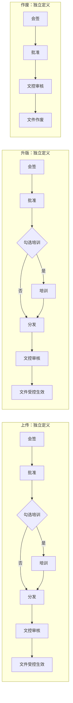

# DCC 上传、升版、作废三套流程开发需求

日期：2026-09-21。状态：开发设计基线，已进行文档 Review；后续代码实施与开发期验证已在 `doc/tasks/20260921-dcc-three-workflows-implementation/` 记录。本文不表示最终运行验收已完成。

## 1. 使用方式与证据边界

本文件定义业务规则；[技术设计](technical-design.md)定义数据、接口、BPM 和改造边界；[验收计划](acceptance.md)定义 Given/When/Then 与开发顺序；[Review 报告](review-report.md)记录复核、修订和设计默认值。[规则变更记录](../changes/20260921-dcc-three-workflows.md)说明与旧文档的冲突及替代范围。

源码核对基线：HEAD `a9bcb6d36d96145ddc1252f111347b644b328deb`，实际分支 `int_qms`，工作区已有未提交业务改动。现状以本次读取的工作区源码为准，不等同于该提交、已部署 BPM 模型或真实数据库现状。继续实施或验收前必须复核技术设计中的源码锚点、指纹和实施任务报告。

## 2. 用户已确认的需求

| 编号 | 确定规则 |
|---|---|
| R01 | 上传、升版、作废三个动作由三套独立流程控制；上传和升版结构相同 |
| R02 | 上传：会签 -> 批准 -> 培训（勾选时）-> 分发 -> 文控审核 -> 文件受控生效 |
| R03 | 升版：会签 -> 批准 -> 培训（勾选时）-> 分发 -> 文控审核 -> 文件受控生效 |
| R04 | 作废：会签 -> 批准 -> 文控审核 -> 文件作废；没有培训、分发 |
| R05 | 上传、升版页面有“培训”checkbox；选中加入培训节点，未选中跳过培训节点 |
| R06 | 会签矩阵只指定要会签的部门；部门负责人配置决定实际会签人 |
| R07 | 管理员事先维护部门负责人，如生产部负责人 shanglei、质量部负责人 xujianghai |
| R08 | 一个部门有且只有一个负责人；没有或多个负责人必须报错 |
| R09 | 会签任务创建时解析并固定负责人；后续配置变更不改变既有任务人员 |

“部门负责人执行会签”按最后确认的“谁来签”理解：任务直接交给负责人本人，不另加负责人再次指定会签人的步骤。用户未授权申请人替换、增删矩阵部门或手选其他会签人。

## 3. 三套流程

| 流程 | 业务动作 | 建议新流程定义 Key | 培训分支 |
|---|---|---|---|
| 上传 | NEW | `dcc-controlled-file-upload` | 实例 `needTraining=true` 时进入 |
| 升版 | REVISION | `dcc-controlled-file-revision` | 实例 `needTraining=true` 时进入 |
| 作废 | OBSOLETE | `dcc-controlled-file-obsolete` | 不存在此分支 |

三个 Key 是拟新增设计，不能当作当前已部署模型。各自独立部署、绑定和版本管理，可复用业务服务；不得三个入口最终仍启动一个公共流程定义。同一上传或升版定义通过条件分支处理是否培训，不因此扩展为五套定义。

文控审核只有最后一处，不保留旧流程开头的文控审核或额外的“文控批准”。受控生效、文件作废是通过最后审核后的系统业务结果，不新增人工“再发布”审批。

## 4. 会签矩阵、负责人及任务

### 4.1 配置职责

- 会签矩阵按现有文件类别维度维护部门集合；不在矩阵中保存负责人 userId、账号、岗位或角色作为会签主体。
- 部门负责人复用系统部门管理的 `leaderUserId` 单选字段，由具备部门维护权限的管理员设置。一个人可负责多个部门，用户未要求跨部门人员唯一。
- 三个动作分别读取本动作的有效路线配置。初次配置可以在页面显式复制部门集合，保存为三份独立配置；运行时不从另一动作借用配置。
- 批准人、文控人员仍使用各自明确配置；“部门只有一名负责人”只约束部门会签，不能擅自扩展到批准人或文控候选人数。

### 4.2 任务创建与冻结

1. 流程提交时冻结本动作、流程定义版本、矩阵版本和部门集合；预览里的负责人只作当前配置展示。
2. 进入会签节点、实际创建本轮任务时，服务端读取这些部门当时的正式负责人配置，验证部门、负责人及审批资格。
3. 全部部门通过校验后，在同一事务中保存逐部门人员快照并创建全部会签任务；任一部门不合法，整批失败，不留下部分部门已签的状态。
4. 每个部门一份会签任务，所有部门通过后才进入批准。同一人负责两个部门，显示两份部门任务，分别留下签名证据，不能按 userId 去重为一份。
5. 同一任务的重试读取原快照；部门负责人改为新用户后，既有任务仍由原用户办理。重新提交形成新流程/新轮次，才在新任务创建时解析当时负责人。

示例：预览时生产负责人为 shanglei；真正创建任务前改为另一用户，新任务交给另一用户。任务已创建后才变更，原任务仍交给 shanglei。新负责人不能仅因当前配置已变更而审批旧任务。

### 4.3 错误与权限

未配置负责人、输入多个负责人、重复/冲突解析结果、部门失效、负责人账号停用或缺必要签名/审批资格，均明确指出部门和原因；不选择第一人、不使用上级负责人、不转给申请人或管理员、不跳过会签。

现有单值 `leaderUserId` 在数据模型上不可能合法保存多名负责人。“多人报错”要通过单选保存合同、拒绝数组/多值输入以及解析结果基数检查共同保证，不能杜撰当前存在一张多负责人表。部门维护不必全系统强制必填；但要启用相应 DCC 路线或创建会签任务，该路线所有部门必须已配置唯一负责人。

负责人变更不自动转办。原负责人后续停用时，任务保留原人员事实并阻断办理；本范围采用撤回/驳回后重新提交的恢复路径，不偷偷转给新负责人。审批授权按冻结任务身份和当前账号/签名资格检查，不再要求原用户仍是该部门当前负责人。

## 5. 培训、分发与最终生效

### 5.1 培训开关

上传与升版均使用 checkbox，初始未选中。正式请求显式传 `needTraining` 布尔值，缺失或非法类型报参数错误；提交后冻结到本轮流程，流程中不允许修改。

`needTraining=true`：批准后创建真实培训任务，完成后进入分发。`needTraining=false`：直接进入分发，不创建培训待办、培训人员记录或培训通知。类别 `trainingRequired` 不再覆盖本次选择；类别仍可提供培训执行参数，不决定是否出现节点。

作废请求不接受培训选项；携带培训字段应明确拒绝，不能出现隐藏的培训分支。分发对上传、升版是必经节点，不再由类别 `distributionRequired=false` 跳过。

### 5.2 节点完成条件（本方案默认）

用户只确认了顺序，未逐项指定培训/分发完成标准。为使设计可执行，本方案采用下列默认值，性质见第 7 节，不冒充用户已确认的业务口径。

| 节点 | 执行人/来源 | 进入下一步条件 |
|---|---|---|
| 会签 | 矩阵各部门在任务创建时的负责人 | 每个部门任务全部同意，任一驳回结束本轮 |
| 批准 | 本动作路线的批准配置，保留现有 ANY 策略 | 至少一名合法批准候选人通过；不能取代前面的全部部门会签 |
| 培训 | 本轮分发对象计划中的培训人员，提交时冻结计划 | 全部人员满足既有阅读时长要求并确认；空名单报错 |
| 分发 | 本轮分发计划，电子接收人/纸质领取人 | 电子全部确认接收，纸质全部有正式签收记录；混合介质全部完成 |
| 文控审核 | 本动作明确配置的文控候选人 | 有资格文控人员核对前序证据、文件版本后签名通过 |
| 生效/作废 | 系统执行 | 文件产物、状态、版本指针、审计等正式处理成功 |

培训默认沿用现有阅读计时与确认能力；当前实现使用 600 秒，新流程冻结明确时长，不以缺字段自动补值。培训名单从分发“计划”取得，不依赖分发已发生；没有适用培训人员的纸质计划不能以空集合自动完成培训。

### 5.3 未生效文件的使用边界

顺序要求培训、分发发生在文控审核之前，因此这些节点处理的是本轮冻结的待生效文件。参与人通过专用任务权限查看该版本，页面明确标识“待生效”；不得为了打开预览提前设置 `ACTIVE` 或伪造受控章。

本方案将分发理解为待生效版本的接收/签收准备。即使已签收，文控审核前仍不能作为当前正式受控版本使用；驳回/撤回必须将本轮分发标为已取消，电子入口失效，已发纸件进入可追溯的收回处理。受控用途的下载、打印仍须遵守最终生效状态与既有权限。

纸质待生效资料须明确标识“待生效，不作为受控副本”；系统盖章不会改变已经发出的纸张。正式受控纸件在生效后通过既有受控打印/发放入口取得，待生效资料按回收规则处理，不能把前面的签收直接记成正式受控纸件已发放。若业务要求本流程“分发”必须完成正式受控纸件发放，需先调整 D04 的业务口径，不能在当前顺序下声称已做到。

最后文控通过后，对同一冻结内容生成受控派生件并建立签名绑定，成功才切换为受控；培训与分发证据通过内容摘要、版本和轮次关联到正式派生件，盖章不能修改已培训正文。失败保留可诊断、可重试状态，不增加人工发布审批，不重新培训或重复签名。

升版处理完成前旧正式版保持有效；成功时在事务内更新新旧版本和 Master 当前指针。作废审批期间原文件保持既有受控状态，并显示“作废审批中”；最终通过才作废、清理当前指针及释放既有名称占用。作废驳回或撤回不作废原文件。

## 6. 页面与使用流程

| 页面 | 必须交付的行为 |
|---|---|
| 系统部门管理 | 负责人单选、保存后回显；变更不改已创建任务 |
| 会签矩阵 | 选择动作和类别，选择部门；负责人只读预览，缺人/失效明确提示；批准、文控配置分区展示 |
| 上传 | 培训 checkbox、完整流程预览、部门及当前负责人只读预览；提交时服务端重新校验 |
| 升版与工作稿送审 | 同样提供 checkbox，不能仅沿用旧版本隐藏值；正确进入独立升版流程 |
| 作废申请 | 原文件与作废原因、三节点预览；无培训选项或分发配置 |
| 审批中心/文件详情 | 当前节点、部门任务、创建时负责人、签名和历史轮次；三种动作均能进入正确详情 |
| 培训与分发工作台 | 显示待生效版本任务，办理后推进本实例；取消任务不能继续办理 |
| 历史记录 | 使用任务历史快照显示当时部门及人员，不用当前配置覆盖历史 |

## 7. 设计默认值与实施前核对

以下是本方案的明确设计选择，用户尚未逐条确认。需要调整时应同步技术设计与对应 BDD，不能开发人员自行改变。

| 编号 | 默认值 | 影响 |
|---|---|---|
| D01 | 会签按部门全部同意；同人多部门分别办理；不开放申请人改人、额外加签和自动转办 | 保证矩阵部门义务完整 |
| D02 | 批准使用现有 ANY，文控沿用正式文控候选资格 | 未新增批准人来源或多人批准制度 |
| D03 | 培训继承本轮分发计划人员，全部达到明确时长并确认 | 培训对象和完成条件需业务核对 |
| D04 | 分发需完成签收；文控前分发的是待生效版本，取消后须收回纸件 | 分发完成口径和纸件管理需业务核对 |
| D05 | 本次“升版”默认覆盖所有正式生成新版并准备受控的修订，包括小版本；不保留“小版直接生效”例外 | 旧设计有免审批例外，本次不得自行沿用 |
| D06 | 三动作独立路线配置，均按现有类别维度；矩阵与分发计划在提交时冻结，负责人在任务创建时冻结 | 用户只明确了负责人冻结时点，其余为配置一致性设计 |
| D07 | 切换前办结或经业务授权撤回旧定义的在途实例，再启用新三流程 | 避免引入旧新混跑的兼容补丁；历史记录保留 |

上述默认值不阻塞文档交付，但需在实施前与业务核对。外来文件审核、注册证、补充证明、打印、例外替换等其他动作不自动纳入三流程；若其入口实际承担本次 NEW/REVISION/OBSOLETE，则必须按正式动作纳管，不能靠换入口绕过。

## 8. 开发完成条件

必须完成技术设计 T01-T10 和验收计划 BDD-01 至 BDD-30。仅新增三个 BPM 名称、前端 checkbox、部门字段或单元测试通过，均不足以说明业务已实现。后续实施须按仓库规则先写 BDD、运行 RED、实现 GREEN、定向回归；只有当轮用户明确要求才执行真实页面 E2E。
