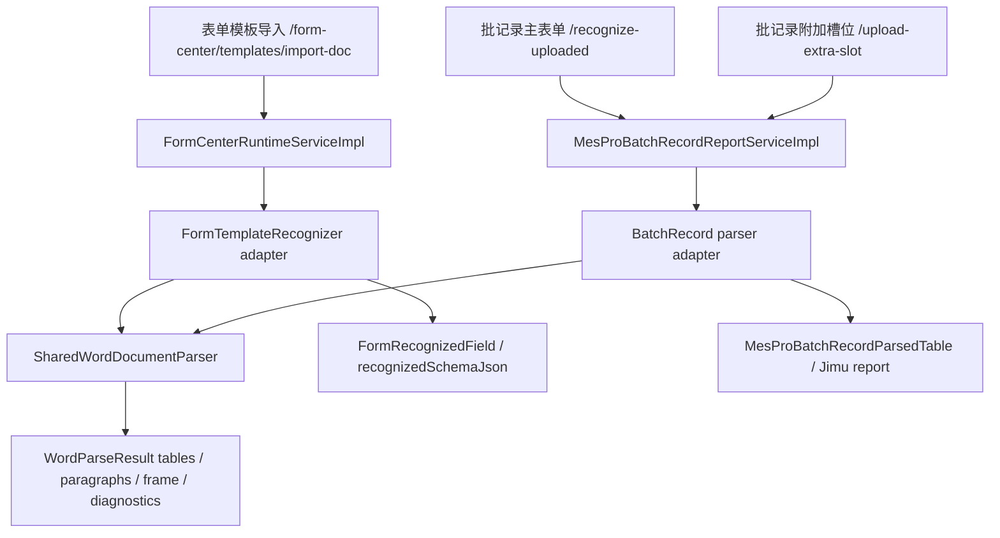

# 共享 Word 表格解析服务系统设计

## Purpose and Scope

本设计定义表单中心与 MES 批记录共用 Word 解析能力的目标架构。目标是保留现有业务接口与审批/版本语义，同时把 `.doc` / `.docx` 的表格、段落、页眉页脚、合并单元格、边框、列宽和文本规范化能力下沉到公共模块，由表单中心映射成“表单模板版本”，由批记录映射成“批记录报表”。

范围包含后端模块边界、共享解析契约、现有服务适配方式、错误模型、开发验证方案、部署影响和开放问题。范围不包含直接合并两个上传接口，也不包含把批记录路线、产品绑定、版本治理逻辑迁入表单中心。

## Evidence Reviewed

- `IntRuoyiFronted/src/api/form-center/template.ts`：表单模板导入调用 `/form-center/templates/import-doc`。
- `IntRuoyiFronted/src/api/mes/pro/batchrecordreport/index.ts`：批记录主 Word 导入调用 `/mes/pro/batch-record-report/recognize-uploaded`，附加表单槽位调用 `/mes/pro/batch-record-report/upload-extra-slot`。
- `IntRuoyiBackend/yudao-module-bpm/src/main/java/cn/iocoder/yudao/module/bpm/controller/admin/formcenter/FormCenterController.java`：表单中心导入入口为 `importDoc`。
- `IntRuoyiBackend/yudao-module-bpm/src/main/java/cn/iocoder/yudao/module/bpm/formcenter/runtime/FormCenterRuntimeServiceImpl.java`：表单模板导入读取文件后调用 `FormTemplateRecognizer`，并维护模板版本、模板池和升版审批。
- `IntRuoyiBackend/yudao-module-bpm/src/main/java/cn/iocoder/yudao/module/bpm/formcenter/runtime/DefaultWordFormTemplateRecognizer.java`：当前表单中心识别器直接用 POI 抽取段落/表格文本标签。
- `IntRuoyiBackend/yudao-module-mes/src/main/java/cn/iocoder/yudao/module/mes/controller/admin/pro/batchrecordreport/MesProBatchRecordReportController.java`：批记录导入入口包含路线、批记录名称、产品绑定、升版动作和附加槽位。
- `IntRuoyiBackend/yudao-module-mes/src/main/java/cn/iocoder/yudao/module/mes/service/pro/batchrecordreport/MesProBatchRecordReportServiceImpl.java`：批记录服务使用 `MesProBatchRecordDocParser` 与路线识别器生成 Jimu 报表和批记录版本。
- `IntRuoyiBackend/yudao-module-mes/src/main/java/cn/iocoder/yudao/module/mes/service/pro/batchrecordreport/MesProBatchRecordDocParser.java`：现有批记录 parser 已覆盖 `.doc` / `.docx` 表格、页眉页脚、合并单元格、边框、列宽和基础版式信息。
- `docs/backend-development.md#edhr-批记录-word-表格解析门禁`：共享 parser 后续实现必须用真实源 DOC 与最小合成表格双重验证，禁止模板名/文件名硬编码特例。

## Current State

表单中心和批记录目前是两套入口、两套业务语义、两套解析实现：

- 表单中心入口面向模板池：`templateName`、`selectedTemplateId`、`remark`、`file`，输出 `FormCenterTemplateImportRespVO`、`recognizedFields`、模板版本和升版审批。
- 批记录入口面向 MES 批记录：`routeKey`、`batchRecordName`、`productNames`、`importAction`、路线版本预期和附加槽位，输出 `BatchRecordReportImportResultVO`、Jimu 报表、批记录版本、路线和产品绑定。
- 表单中心解析偏“字段标签识别”，当前识别粒度是段落/单元格文本。
- 批记录解析偏“结构化表格还原”，当前识别粒度是表格、行、单元格、列宽、边框、合并关系、页眉页脚和路线特定表格规则。

因此，不能通过前端改 URL 或后端复用 MES Controller 来“一致”。正确的一致化边界是共享 Word 文档结构解析，再分别进入业务映射层。

## Target Architecture



新增一个位于 BPM 与 MES 下层的共享解析模块，建议命名为 `yudao-module-word-parser` 或 `yudao-module-form-parser`。该模块只依赖 `yudao-common`、POI 及必要的基础工具，不依赖 BPM、MES、数据库、Jimu、Flowable 或业务审批模块。

推荐模块边界：

- `yudao-module-word-parser`
  - 提供 `SharedWordDocumentParser`、解析命令、解析结果、结构化文档模型和 fail-fast 异常。
  - 负责纯 Word 文档解析，不判断业务路线、不生成表单字段、不写数据库、不调用 Jimu。
- `yudao-module-bpm`
  - 保留 `/form-center/templates/import-doc`。
  - `DefaultWordFormTemplateRecognizer` 改为依赖共享 parser，并把 `WordParseResult` 映射为 `FormRecognizedField`。
  - 模板版本、模板池、升版审批、`recognizedSchemaJson` 持久化逻辑保持在 `FormCenterRuntimeServiceImpl`。
- `yudao-module-mes`
  - 保留 `/mes/pro/batch-record-report/recognize-uploaded` 与 `/upload-extra-slot`。
  - `MesProBatchRecordDocParser` 收敛为共享 parser 的适配层，或逐步替换为 `BatchRecordWordParseAdapter`。
  - 路线识别器、批记录版本、Jimu 报表生成、产品绑定和版本治理继续保留在 MES。

依赖方向必须被自动化门禁验证：

- 共享解析模块不得依赖 `yudao-module-bpm`、`yudao-module-mes`、`yudao-module-report`、数据库 starter、Flowable、Jimu 或任一业务模块。
- `yudao-module-bpm` 可以依赖共享解析模块，但不得依赖 `yudao-module-mes`。
- `yudao-module-mes` 可以继续依赖 `yudao-module-bpm`，并新增依赖共享解析模块。
- 实现任务必须新增 Maven/静态契约测试，读取相关 `pom.xml` 或依赖树，明确断言上述依赖方向；该测试失败时不得进入功能迁移。

## Shared Parser Contract

共享 parser 对外提供稳定的内部 Java 契约，不新增前端 API。

建议接口：

```java
public interface SharedWordDocumentParser {
    WordParseResult parse(WordParseCommand command);
}
```

建议命令模型：

- `sourceFileName`：原始文件名，用于文件类型判断和诊断。
- `sourceBytes`：上传文件内容；为空时 fail fast。
- `options`：解析选项，例如是否抽取段落、页眉页脚、表格边框、列宽、文档页数。

`options` 不得成为 BPM/MES 解析分叉点。第一阶段必须定义并默认使用同一个 canonical profile，例如 `WordParseProfile.STRUCTURAL_CANONICAL`：

- BPM 表单中心和 MES 批记录导入都必须调用 canonical profile。
- canonical profile 必须固定开启段落、页眉页脚、顶层表格、拆分表格、合并关系、逻辑列、视觉列宽、边框、斜线、字体粗细、字号、水平/垂直对齐和非敏感诊断。
- `options` 只能增加非破坏性诊断或性能采样；不得允许某个调用方关闭结构字段并仍宣称与另一调用方“解析一致”。
- 如后续确需新增 profile，必须新增 profile 等价性/差异性测试，并在对应业务 adapter 文档中说明为什么不能使用 canonical profile。

建议结果模型：

- `WordParseResult`
  - `sourceFileName`
  - `documentFrame`：页眉、页脚和文档级信息。
  - `paragraphs`：表格外段落块，供表单中心保留当前段落标签识别能力。
  - `tables`：顶层表格和拆分后的表格段。
  - `diagnostics`：非敏感解析诊断，例如表格数量、空表数量、被跳过的空段落数量。
- `WordParsedTable`
  - `tableTitle`
  - `sourceTopLevelTableIndex`
  - `sourceSplitIndex`
  - `rowCount`
  - `columnCount`
  - `columnWidths`
  - `rows`
- `WordParsedCell`
  - `text`
  - `rowSpan`
  - `colSpan`
  - `columnIndex`
  - `logicalColumnIndex`
  - `logicalColSpan`
  - `bold`
  - `fontSize`
  - `horizontalAlign`
  - `verticalAlign`
  - `widthPx`
  - `heightPx`
  - `topBorderStyle`
  - `bottomBorderStyle`
  - `leftBorderStyle`
  - `rightBorderStyle`
  - `diagonalSlash`

共享模型不得包含 `fillable`、`componentFlag`、`edhrCellRule`、`routeKey`、`batchRecordName`、`templateId` 等业务语义。业务字段必须在 BPM/MES adapter 中生成。

## Backend API Design

### External API Contracts

现有外部 API 保持不变：

- `POST /form-center/templates/import-doc`
  - 权限：`form:template:create`
  - 用途：导入表单中心模板，创建 `DRAFT` 或触发升版审批。
  - 变更：内部识别器改用共享 parser；请求/响应不变。
- `POST /mes/pro/batch-record-report/recognize-uploaded`
  - 权限：当前 Controller 未声明 `@PreAuthorize`；共享 parser 重构不得改变该权限合同。
  - 用途：上传主批记录 Word，按路线和产品绑定生成批记录报表。
  - 变更：内部 doc 结构解析改用共享 parser；请求/响应不变。
- `POST /mes/pro/batch-record-report/upload-extra-slot`
  - 权限：当前 Controller 未声明 `@PreAuthorize`；共享 parser 重构不得改变该权限合同。
  - 用途：上传批记录附加表单槽位 Word。
  - 变更：内部 doc 结构解析改用共享 parser；请求/响应不变。

不新增跨业务的“通用上传导入”HTTP 接口。共享能力只作为后端内部服务使用，避免前端绕开模板池、批记录版本治理或审批流程。

若产品决定给批记录导入补充显式权限，必须另起权限变更设计，覆盖菜单/按钮权限、租户套餐、角色授权、前端 `v-hasPermi`、后端 `@PreAuthorize` 和真实登录态回归；不得混入共享 parser 重构。

### Internal Adapters

表单中心 adapter：

- 输入：`WordParseResult`。
- 输出：`FormTemplateRecognition`。
- 映射规则：
  - 表格外段落和表格单元格都可作为候选 label。
  - 空文本、超长文本、重复 label 按当前表单中心规则过滤。
  - 字段编码、字段类型猜测和必填判断仍由 `FormTemplateRecognizer` 负责。
  - 若无可识别字段，返回明确失败，不返回空成功。

批记录 adapter：

- 输入：`WordParseResult`。
- 输出：`MesProBatchRecordParsedTable` 或后续替代模型。
- 映射规则：
  - 保留当前 `MesProBatchRecordDocParser` 对 rowSpan、colSpan、视觉列宽、逻辑列、边框、页眉页脚和 doc/docx 差异处理的语义。
  - Route A/F 等通用路线识别器使用共享表格结构；Route B/D/E 的路线特定识别仍在 MES 内部实现。
  - `fillable`、`componentFlag`、签名规则、单元格规则、Jimu JSON 构建继续在 MES 报表构建链路中生成。

## Error Model

共享 parser 必须 fail fast，不提供 silent fallback：

- `WORD_PARSE_FILE_EMPTY`：上传内容为空。
- `WORD_PARSE_SOURCE_TYPE_UNSUPPORTED`：扩展名不是 `.doc` 或 `.docx`。
- `WORD_PARSE_SOURCE_INVALID`：POI 无法打开或文档损坏。
- `WORD_PARSE_TABLE_STRUCTURE_INVALID`：表格结构无法形成稳定行/列模型。
- `WORD_PARSE_NO_CONTENT`：文档没有可解析段落或表格。

BPM/MES adapter 不吞共享异常：

- 表单中心将共享异常映射为 `FormCenterException` 的明确业务错误，响应给导入弹窗。
- MES 将共享异常映射为现有批记录导入错误码，响应给批记录导入弹窗。
- 禁止把解析失败转换为空字段、空报表、默认成功或改走旧 parser。

错误映射必须落地为测试覆盖的合同：

| Shared parser error | BPM 表单中心映射 | MES 批记录映射 |
| --- | --- | --- |
| `WORD_PARSE_FILE_EMPTY` | `TEMPLATE_SOURCE_INVALID` | `PRO_BATCH_RECORD_REPORT_FILE_EMPTY` |
| `WORD_PARSE_SOURCE_TYPE_UNSUPPORTED` | `TEMPLATE_SOURCE_TYPE_UNSUPPORTED` | `PRO_BATCH_RECORD_REPORT_FILE_EXTENSION_INVALID` |
| `WORD_PARSE_SOURCE_INVALID` | `TEMPLATE_SOURCE_INVALID` | `PRO_BATCH_RECORD_REPORT_PARSE_FAILED` |
| `WORD_PARSE_TABLE_STRUCTURE_INVALID` | `TEMPLATE_RECOGNITION_FAILED` | `PRO_BATCH_RECORD_REPORT_PARSE_FAILED` |
| `WORD_PARSE_NO_CONTENT` | `TEMPLATE_RECOGNITION_FAILED` | `PRO_BATCH_RECORD_REPORT_TABLE_COUNT_INVALID` |

实现任务必须新增 BPM/MES adapter 错误映射测试，确认前端仍收到可读业务错误，不退化成通用 500 或空成功。

### 跨层错误码与 canonical 等价门禁

- Trigger: 共享 parser 通过业务 adapter、recognition result 或 service 多层返回错误，或多个业务入口声称消费同一 canonical 解析结果。
- Preflight check: 逐项列出共享失败码到业务错误码的映射，并检查中间结果对象是否能携带业务错误码到最终异常；等价测试分别比较 source bytes、extension、profile、段落、页眉页脚、表格和 source hash。
- Blocker: 任一中间层把多个 typed failure 收敛为通用错误，或等价测试只断言构造器/profile 而未比较真实源结构时立即停止；`fileNameHash` 由各 adapter 的独立原始文件名产生，不得混入 canonical 结构等价判定。
- Verification: BPM/MES 分别覆盖五类 typed failure 的精确业务错误与无副作用断言；同一真实 DOC 经两个 adapter 后的 canonical 结构和 source hash 完全一致。
- Forbidden action: 禁止用 failure reason 字符串代替业务错误码传递，禁止用通用解析失败覆盖精确错误，禁止因 filename diagnostics 不同而改写共享结构或伪造相同文件名。
- Evidence: `doc/tasks/20260807-shared-word-parser-implementation/execution-log.md` 的 `T8 Corrective FR-10 Error Mapping Loop`。

## Data Model

本设计不要求新增业务表或迁移 SQL。

现有持久化保持不变：

- 表单中心继续写入 `form_template_version` 类数据对象中的模板版本、源文件内容、`recognizedSchemaJson` 和状态。
- 批记录继续写入批记录定义、批记录版本、生成报表、迁移项、Jimu 报表和路线绑定。

共享 parser 结果不直接持久化为新表。若后续需要诊断追踪，只允许保存脱敏摘要，例如解析版本号、表格数量、失败错误码和 source hash，不保存完整源文本到新增日志表。

## Transactions and Idempotency

- 共享 parser 是无状态纯解析服务，不开启数据库事务。
- 表单中心导入事务仍由 `FormCenterRuntimeServiceImpl#importDoc` 控制。
- 批记录导入事务仍由 `MesProBatchRecordReportServiceImpl` 控制。
- 共享 parser 不负责幂等；业务幂等仍由模板版本、批记录版本、source hash、导入动作和业务唯一键控制。
- 若 parser 成功但业务持久化失败，事务回滚由调用方负责，parser 不做补偿。

## Frontend Design

第一阶段不修改前端交互与 API wrapper：

- 表单模板导入弹窗继续调用 `TemplateApi.importTemplateDoc()`。
- 批记录导入弹窗继续调用 `BatchRecordReportApi.recognizeUploadedRoute()` 和 `uploadExtraFormSlot()`。
- 用户看到的变化应是解析一致性提升，而不是入口、权限、按钮或确认流程变化。
- 错误提示仍展示后端返回 message；前端不得在一个接口失败后自动改打另一个接口。

若后续需要展示解析诊断，可在各自业务响应中追加非破坏性 `warnings` 或诊断摘要；不得要求前端直接消费共享 parser 的内部模型。

## Configuration, Security, and Deployment

配置：

- 不新增外部服务、队列、对象存储或远端识别服务。
- 新共享模块引入 POI 依赖，版本与当前 BPM/MES 使用的 POI 版本保持一致。
- 可选新增内部 parser version 常量，用于诊断和回归证据。

权限：

- HTTP 权限不变：表单中心仍使用 `form:template:create`，批记录仍使用批记录相关权限。
- 共享 parser 不暴露 Controller，因此不需要新增菜单权限。

安全：

- 不在日志记录完整 Word 文本、文件内容、源文件 base64、原始文件名或敏感业务数据。
- 解析失败日志只记录 source hash、文件扩展名、脱敏后的文件名摘要、错误码、表格数量等非敏感摘要。
- 上传文件大小、认证、租户上下文继续由现有 Controller/请求链路控制。

部署：

- 后端 Maven parent 增加共享模块后，`yudao-module-bpm` 与 `yudao-module-mes` 依赖该模块。
- 禁止让 `yudao-module-bpm` 依赖 `yudao-module-mes`；当前 MES 已依赖 BPM，反向依赖会形成循环依赖。
- 如果选择把 parser 放入 BPM 模块，MES 可以编译但会扩大 BPM 内部职责；推荐新建下层共享模块以保持长期边界清晰。

## Observability

共享 parser 应输出结构化诊断对象，并由调用方按业务日志策略记录：

- `parserVersion`
- `sourceHash`
- `sourceFileExtension`
- `sourceFileNameHash`
- `fileType`
- `paragraphCount`
- `topLevelTableCount`
- `parsedTableCount`
- `warningCodes`
- `failureCode`

诊断信息用于回归定位，不用于业务成功判定。出现 blocker 时必须保留任务证据和测试 fixture 缺失说明。

## Migration Plan

1. 新增共享解析模块和共享模型，不修改现有业务接口。
2. 新增依赖方向静态契约测试，先证明共享模块、BPM、MES 的 Maven 依赖边界不会形成循环依赖。
3. 将 `MesProBatchRecordDocParser` 中纯 Word 结构解析能力迁入共享模块，保留原类作为 MES adapter。
4. 在迁移 MES 业务调用前，建立旧 parser 与共享 parser 的结构快照等价测试；真实 DOC 与合成表格都必须覆盖。
5. 迁移 MES 批记录测试，确保 `MesProBatchRecordDocParserTest`、路线识别器和报表构建测试在共享 parser 下保持通过。
6. 将 `DefaultWordFormTemplateRecognizer` 改为调用共享 parser，并补充表单中心 doc/docx 标签识别测试。
7. 更新 Maven 依赖：BPM/MES 依赖共享模块，共享模块不得依赖 BPM/MES。
8. 移除重复 POI 解析逻辑或将其标记为 adapter，不保留两套可分叉 parser。
9. 运行定向回归后再考虑是否暴露解析诊断字段；第一阶段不改前端 API。

## Development Verification Plan

后续实现必须按门禁顺序推进，上一门禁未通过不得进入下一门禁。所有失败都必须保留原始失败命令、失败原因和影响范围，不得以临时 fallback、旧 parser 兜底或人工截图替代自动化证据。

| Gate | 目标 | 必做验证 | 通过标准 | 阻塞条件 |
| --- | --- | --- | --- | --- |
| Gate 0 依赖边界 | 先证明模块方向正确 | 新增/运行 Maven 静态契约，检查 parent `modules`、BPM/MES/shared parser `pom.xml` 和依赖树 | shared parser 不依赖 BPM/MES/数据库/Flowable/Jimu；BPM 不依赖 MES；MES 只新增 shared parser 依赖 | 任何循环依赖、shared parser 依赖业务模块、BPM 反向依赖 MES |
| Gate 1 共享 parser 核心 | 证明 Word 结构化解析能力独立可用 | shared parser 单测覆盖 `.doc`、`.docx`、空文件、非 Word、损坏文件、无内容、表格结构异常 | `WordParseResult` 稳定输出段落、页眉页脚、顶层/拆分表格、合并关系、列宽、边框和脱敏 diagnostics | fixture 缺失、异常被吞、返回空成功、诊断记录原始文件名或原始文本 |
| Gate 2 canonical profile | 证明 BPM/MES 解析入口一致 | `WordParseProfile.STRUCTURAL_CANONICAL` 合同测试，断言 BPM/MES adapter 均使用同一 profile | 两个业务入口不得通过自定义 options 关闭结构字段；新增 profile 必须有差异性测试 | 任一 adapter 私自关闭段落、表格、合并关系、列宽、边框或 diagnostics |
| Gate 3 旧新等价 | 证明 MES 迁移不损失现有 parser 能力 | 真实 DOC fixture 与最小合成表格的旧 `MesProBatchRecordDocParser` / shared parser 快照等价测试 | 至少比较表格数、标题、行列数、行高/列宽、合并关系、边框、页眉页脚和单元格文本 | 无真实 DOC fixture、快照漂移未解释、按文件名/模板名写特例 |
| Gate 4 MES adapter | 证明批记录业务语义不漂移 | `MesProBatchRecordDocParserTest`、`MesProBatchRecordReportServiceImplDbTest`、Controller 权限合同与 Route A/B/D/E/F 定向测试 | `recognize-uploaded`、`upload-extra-slot` URL、请求/响应、当前权限合同、Jimu JSON、布局校准和版本治理不变 | 批记录权限漂移、路线识别退化、报表 JSON 或版本治理失败 |
| Gate 5 BPM adapter | 证明表单模板导入语义不漂移 | `DefaultWordFormTemplateRecognizer`、`FormCenterRuntimeContractTest`、`FormTemplateLifecycleServiceTest` 定向测试 | `/form-center/templates/import-doc` URL、权限、模板版本生命周期、字段 label 识别和空字段失败语义不变 | 导入失败仍创建版本、错误变通用 500、字段识别低于当前能力 |
| Gate 6 前端合同 | 证明用户入口不被改写 | 前端静态合同检查 `TemplateApi.importTemplateDoc()`、`BatchRecordReportApi.recognizeUploadedRoute()`、`uploadExtraFormSlot()` | 三个 wrapper 的 URL 和调用入口保持不变；前端不自动改打其它接口 | 表单中心改用 MES URL、批记录改用表单中心 URL、失败后自动切换接口 |
| Gate 7 集成回归 | 证明迁移完成且无隐藏降级 | 运行 Gate 0-6 全量命令矩阵，汇总 fixture、快照、错误映射和权限合同证据 | 所有定向测试通过，`git diff --check` 通过，任务文档记录 RED/GREEN/REGRESSION | 任一门禁未跑、证据缺失、只靠人工验证或截图宣称完成 |

建议实现任务采用以下 RED/GREEN 顺序：

1. RED：先补依赖方向静态契约和 shared parser fixture 测试，确认当前无 shared module 时失败。
2. GREEN：新增 shared parser module、模型、异常和 `STRUCTURAL_CANONICAL` profile，使 Gate 0-2 通过。
3. RED：补旧/新 parser 快照等价测试，锁定现有 MES 表格结构输出。
4. GREEN：迁移纯 Word 解析到 shared parser，保留 MES adapter 业务映射，使 Gate 3-4 通过。
5. RED：补 BPM shared parser adapter、错误映射和 runtime 生命周期合同。
6. GREEN：切换 `DefaultWordFormTemplateRecognizer` 到 shared parser，使 Gate 5 通过。
7. REGRESSION：运行前端 URL 静态合同和后端定向回归，完成 Gate 6-7。

开发证据必须落在实现任务的 `doc/tasks/<task-id>/execution-log.md` 与 `verification-report.md`，至少包含：

- BDD 场景：共享解析一致性、业务接口不变、无循环依赖、fail-fast 错误映射。
- RED 证据：依赖门禁、fixture parser、旧/新等价、BPM/MES adapter 中至少一个先失败用例。
- GREEN 证据：对应 Maven/JUnit/静态合同命令和通过摘要。
- 回归证据：BPM、MES、前端 URL 合同和 `git diff --check`。
- 阻塞证据：真实 DOC fixture、权限合同、测试数据或模块依赖缺失时的 fail-fast 说明。

## Verification Strategy

本节定义测试覆盖面；执行顺序以 `Development Verification Plan` 为准。

共享 parser 单元测试：

- 依赖方向测试：共享模块不得依赖 BPM/MES/数据库/Flowable/Jimu，BPM 不得依赖 MES，MES 可依赖 BPM 和共享模块。
- canonical profile 测试：BPM/MES adapter 都使用 `STRUCTURAL_CANONICAL`，不得传入会关闭结构字段的自定义 options。
- `.doc` 表格解析：合并单元格、rowSpan、colSpan、视觉列宽、边框、标题、页眉页脚。
- `.docx` 表格解析：gridSpan、vMerge、表格外段落、页眉页脚、页数上下文。
- 异常路径：空文件、非 doc/docx、损坏文件、无可识别内容。
- 经验门禁场景：packed 物料矩阵、括号续行、短标题 + 长说明行、生产自检/合格标准/检验方法说明块。
- 旧/新 parser 等价测试：对现有真实 DOC fixture 和最小合成表格输出稳定结构快照，至少比较表格数、标题、行列数、行高/列宽、合并关系、边框、页眉页脚和单元格文本。

MES 回归：

- `MesProBatchRecordDocParserTest`
- 路线识别器测试：Route A/B/D/E/F 覆盖现有差异。
- 批记录报表 JSON、布局校准、Jimu 网关和 DB service 相关定向测试。
- 用户指定真实 DOC 样本导入验证；缺 fixture 时必须阻塞。
- 权限合同测试：`recognize-uploaded` 和 `upload-extra-slot` 在 parser 重构中不得新增、删除或漂移权限；如另行加权限，必须由权限变更任务覆盖。

BPM 回归：

- `DefaultWordFormTemplateRecognizer` 新增/更新测试，覆盖段落 label、表格 cell label、重复过滤、字段类型猜测、空字段失败。
- `FormCenterRuntimeContractTest` 确认 `/form-center/templates/import-doc` 外部接口不变。
- `FormTemplateLifecycleServiceTest` 或 runtime service 测试确认导入失败不会创建模板版本。
- 错误映射测试：共享 parser 的空文件、类型不支持、损坏文件、结构失败和无内容错误必须映射到表单中心既有错误码。

前端回归：

- 静态契约确认 `TemplateApi.importTemplateDoc()`、`BatchRecordReportApi.recognizeUploadedRoute()` 和 `uploadExtraFormSlot()` URL 不变。
- 如后续错误 message 变化，补充导入弹窗错误提示断言。

## Open Questions

- 新共享模块最终命名采用 `yudao-module-word-parser` 还是 `yudao-module-form-parser`。
- 是否允许共享 parser 模型包含 paragraph block 的字体、对齐、行高等版式字段，还是第一阶段只保留文本。
- `MesProBatchRecordParsedCell` 中非纯解析字段的拆分清单需要在实现前逐字段确认。
- 表单中心是否需要利用表格位置推断字段分组、必填范围或签名字段，还是第一阶段只复用文本 label 抽取。

## Design Blockers

- 若无法取得现有批记录真实源 DOC fixture，不能启动 parser 行为迁移实现。
- 若共享模块被设计为依赖 BPM 或 MES 任一业务模块，必须阻塞并重构依赖方向。
- 若无法稳定复现当前批记录 Word 表格解析门禁中的结构偏差，不能宣称共享 parser 达到批记录现有质量。
- 若外部 API 需要变更请求/响应字段，必须另行评审并更新前端、权限和回归方案；本设计第一阶段不包含 API 变更。
