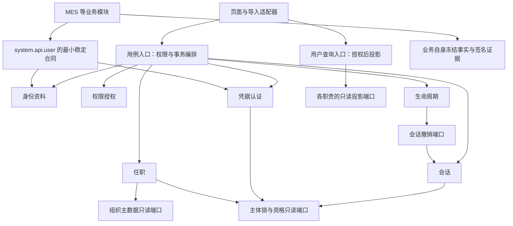

# 用户管理模块化单体架构

版本：2026-10-09。源码HEAD基线：`6a012519b958cfa78c4be0db647c3aa1e2624f49`。证据来自该HEAD下当前工作树的静态阅读，包含原已存在的并行未提交改动，不是干净提交快照或运行态证明；未来阶段须重新读取届时完整链路，本任务不接管并行文件。这是目标设计与实施边界，不是实现完成或运行验收证明；是否放行由本任务主Agent的评审记录决定。

## 业务目标与原则

保持 Java 17 / Spring Boot / Maven 和 Vue 3 / Vite / TypeScript。继续使用一个后端部署和既有数据库，通过职责、接口与事务边界降低耦合；不因本设计拆微服务、复制用户系统或强制拆表。

业务上的目标是：改岗位规则只影响任职职责；改密码策略主要影响认证职责；用户列表可在只有用户查询权限时完整加载；改名、转岗或停用不改变历史签名与业务事实。

| 评审维度 | 覆盖原则 | 必须证明的结果 |
| --- | --- | --- |
| G1 职责、依赖、业务操作 | P1 明确操作 | 写入有明确用例、权限、允许字段、审计与负责人；没有双向服务编排 |
| G2 权威来源与历史事实 | P2 单一来源、P4 当前与历史分开 | 任职来源明确；历史信息由创建事实的业务模块冻结，不能以当前资料回填 |
| G3 安全与一致性 | P3 整体完成安全操作 | 租户、数据范围、真实事务、锁顺序、发令牌与撤销并发、缓存和失败分支明确 |
| G4 查询与页面边界 | P5 前端交互、后端事实 | 授权后批量投影；页面不逐人查询角色或加载管理目录来拼名称 |

用户提及“四条”，此前建议实际包含五条；此处保留五条并按四个维度评审。

## 当前证据索引

以下均为静态阅读的现状依据。路径是仓库相对路径，方法是复核锚点；开发时须针对届时源码重新阅读完整调用链。不存在的方法只能标为 proposed。

| ID | 当前文件 | 锚点与观察 |
| --- | --- | --- |
| E01 | `IntRuoyiFronted/src/views/system/user/index.vue` | `loadDeptMetadata`、`loadUserDisplayMetadata`、`loadRoleNamesByUserId`、`getList`：加载部门管理列表、遍历岗位/角色分页、逐用户读取角色；页面再排序 |
| E02 | `IntRuoyiFronted/src/api/system/user/index.ts` | `getUserPage`、`getUserForUpdate`、`updateUser`、`resetUserPassword`、`unlockUser`；解锁调用当前未传原因 |
| E03 | `IntRuoyiBackend/yudao-module-system/src/main/java/cn/iocoder/yudao/module/system/controller/admin/user/UserController.java` | `getUserPage` 用 user:query；当前仅拼部门；`getUserForUpdate`、密码、状态、生命周期、导入写入口 |
| E04 | `IntRuoyiBackend/yudao-module-system/src/main/java/cn/iocoder/yudao/module/system/service/user/AdminUserServiceImpl.java` | `getUserPage`、`getDeptCondition`、`sortUsersByDeptLeader`、`buildPagedResult`：有部门条件时先全量读取、分组排序、内存分页 |
| E05 | `IntRuoyiBackend/yudao-module-system/src/main/java/cn/iocoder/yudao/module/system/dal/mysql/user/AdminUserMapper.java` | `selectPage`、`selectListForPage`、`selectPermissionSubjectForUpdate`、`selectPostIdsForUpdate`：过滤与 id DESC、用户行和原始岗位 JSON 锁 |
| E06 | `IntRuoyiFronted/src/views/system/user/UserForm.vue` | `open`、`validateAssignedPosts`、`submitForm`：正式既有岗位与启用候选分别读取；全部就绪后才激活完整表单 |
| E07 | `IntRuoyiBackend/yudao-module-system/src/main/java/cn/iocoder/yudao/module/system/service/user/AdminUserServiceImpl.java` | `updateUser`、`lockAndValidateUserPosts`、`updateUserPost`、`getUserForUpdate`：完整目标岗位集合、JSON/关联对账、锁与差量写 |
| E08 | `IntRuoyiBackend/yudao-module-system/src/main/java/cn/iocoder/yudao/module/system/dal/mysql/dept/UserPostMapper.java` | `selectListByUserIdForUpdate`、`deleteByUserIdAndPostId`：有效关联按岗位及行 ID 排序加锁 |
| E09 | `IntRuoyiFronted/src/views/system/user/UserAssignRoleForm.vue` | `open`、`submitForm`：角色变更原因与幂等键；角色分配页仍是独立入口 |
| E10 | `IntRuoyiBackend/yudao-module-system/src/main/java/cn/iocoder/yudao/module/system/controller/admin/permission/PermissionController.java` | `listAdminRoles`、`assignUserRole`：读取用户角色也要求 assign-user-role，不能作为普通列表展示依赖 |
| E11 | `IntRuoyiBackend/yudao-module-system/src/main/java/cn/iocoder/yudao/module/system/service/permission/PermissionServiceImpl.java` | `assignUserRole`、`applyUserRole`、`validateAssignableUserRoles`、`getUserRoleIdListByUserId`：正式关联、受限角色保护、GxP 审计协议 |
| E12 | `IntRuoyiBackend/yudao-module-system/src/main/java/cn/iocoder/yudao/module/system/dal/mysql/permission/UserRoleMapper.java` | `selectPermissionRowsForUpdate`、`selectListByUserId`：租户内正式永久角色关系；目前没有列表页批量摘要方法 |
| E13 | `IntRuoyiBackend/yudao-module-system/src/main/java/cn/iocoder/yudao/module/system/framework/datapermission/config/DataPermissionConfiguration.java` | `sysDeptDataPermissionRuleCustomizer`：AdminUserDO 的部门/本人范围；自定义 SQL 不能遗漏 |
| E14 | `IntRuoyiFronted/src/views/system/dept/components/DeptTreeSelect.vue` | `loadTree` 调用 `getSimpleDeptList`；此为多页面复用组件 |
| E15 | `IntRuoyiBackend/yudao-module-system/src/main/java/cn/iocoder/yudao/module/system/service/dept/DeptServiceImpl.java` | `getSimpleDeptList` 关闭数据权限；`getChildDeptList` 按层遍历；`getDeptList` 含排序 |
| E16 | `IntRuoyiBackend/yudao-module-system/src/main/java/cn/iocoder/yudao/module/system/service/user/AdminUserServiceImpl.java` | 两个 `updateUserPassword`、`updateUserStatus`、`recordUserLifecycleDeactivation`、`processDueLifecycleDeactivations`、`lockUserForSessionMutation` |
| E17 | `IntRuoyiBackend/yudao-module-system/src/main/java/cn/iocoder/yudao/module/system/service/oauth2/OAuth2TokenServiceImpl.java` | `createPasswordAccessToken`、`refreshLocatedAdmin`、`removeAccessToken(Long,Integer)`、`readOfficialAccessToken`、`checkAccessToken`：正式令牌、用户状态、统一锁序 |
| E18 | `IntRuoyiBackend/yudao-module-system/src/main/java/cn/iocoder/yudao/module/system/api/user/AdminUserApi.java` | 已有 `getUser`、`getUserList`、`validateUserList`、`reauthenticateForSignature`；渐进演进该 API 边界 |
| E19 | `IntRuoyiBackend/yudao-module-system/src/main/java/cn/iocoder/yudao/module/system/api/user/AdminUserApiImpl.java` | `getUser` 忽略数据权限且从关联覆盖岗位；`getUserList` 忽略数据权限并直接转换 JSON 岗位；不能充当公开列表授权 |
| E20 | `IntRuoyiBackend/yudao-module-system/src/main/java/cn/iocoder/yudao/module/system/dal/dataobject/user/AdminUserDO.java` | `system_users`：资料、凭据、状态、生命周期、JSON 岗位目前共表 |
| E21 | `IntRuoyiBackend/yudao-module-system/src/main/java/cn/iocoder/yudao/module/system/service/tenant/TenantServiceImpl.java` | `createTenant` 调用 `userService.createUser`；用户服务反向调用 tenantService 做配额校验 |
| E22 | `IntRuoyiBackend/yudao-module-mes/src/main/java/cn/iocoder/yudao/module/mes/service/pro/processpool/team/MesTeamLeaderActiveOrderDetailServiceImpl.java` | `getDetail`、`toMaintenanceOperationFact`、`attachPqcProductionRelease`：部分历史展示读取当前用户昵称 |
| E23 | `IntRuoyiBackend/yudao-module-mes/src/main/java/cn/iocoder/yudao/module/mes/service/pro/productionrelease/pqc/MesPqcReleaseOrderDetailService.java` | `get`、`attachPqcProductionReleaseSummary`、`requireUnifiedPqcReleaseSignature`：验证签名后仍查当前昵称 |
| E24 | `IntRuoyiBackend/yudao-module-mes/src/main/java/cn/iocoder/yudao/module/mes/service/pro/processpool/team/MesSubmissionSignatureIdentityReader.java` | `read`、`frozenName`：已有正式提交从验签后冻结身份读取；须保留 SYSTEM_USER 与 MES_EMPLOYEE_PROFILE 区别 |
| E25 | `IntRuoyiBackend/yudao-module-signature/src/main/java/cn/iocoder/yudao/module/signature/service/ElectronicSignatureServiceImpl.java` | `signInternal`：存在 authorized identity 时将身份写入 canonicalContentJson；系统用户无该参数的分支当前不会自动生成同一快照 |
| E26 | `IntRuoyiBackend/yudao-module-signature/src/main/java/cn/iocoder/yudao/module/signature/service/ElectronicSignatureQueryServiceImpl.java` | `toEvidence`：缺冻结身份时存在读取当前资料的旧分支；目标要求不能据此证明历史姓名 |

### 实际业务链与证据边界

1. 列表：E01 → E02 `getUserPage` → E03 → E04 → E05 → E03 `UserConvert.convertList`；部门/岗位/角色另外由 E01 多个管理请求与 E10/E11/E12 拼装。主问题为展示与管理权限耦合及逐行请求。
2. 资料/岗位保存：E06 → E02 `updateUser` → E03 → E07 → E05/E08 与 `PostMapper.selectListByIdsForUpdate` → 两份岗位数据与资料同事务写入。当前 UM-04 严格拒绝不一致，不允许普通编辑顺带修复。
3. 角色分配：E09 → `src/api/system/permission/index.ts` → E10 → E11 → E12 与权限命令审计持久化。列表目标只读该事实，不改变写权限或高权限保护。
4. 凭据/会话：列表密码重置或个人资料改密 → E03 或 `UserProfileController.updateUserProfilePassword` → E16 → 密码历史、用户更新 → E17 正式 access/refresh 删除与 Redis 清理。发令牌及刷新重新加用户锁核对状态和认证快照；认证过滤器消费正式验证结果。历史 UM-05/S-01 合同保留，详见安全设计。
5. 生命周期/导入：`UserLifecycleDeactivateForm.vue.submitForm` → E02 → E03 → E16 → 用户停用与 E17；`UserImportForm.vue` / `UserDingTalkImportForm.vue` → E03 → E04 所在服务的 `importUserList` / `importDingTalkUserList` → 当前直接写用户/部门，不能说已经统一生命周期。UM-02 暂缓。
6. MES 历史：`src/views/mes/pro/processpool/ActiveOrderSubmissionDetailPage.vue` / `TeamLeaderWorkbenchPage.vue` → `src/api/mes/pro/processpool/teamLeader.ts.getTeamLeaderActiveOrderDetail` → `MesProcessPoolTeamLeaderController.getActiveOrderDetail` → E22；`src/views/mes/pro/production-release/PqcProductionReleasePage.vue` → `src/api/mes/pro/productionRelease/index.ts.getPqcProductionReleaseOrderDetail` → `MesPqcReleaseOrderDetailController.get` → E23 → 正式签名查询/验签与当前用户查询。E24 是已有正确冻结路径，E22/E23/E26 是后续改进范围，不把相邻路径的正确实现当成全链已通过。

## 目标职责及允许依赖

下表职责是 proposed 内部包/接口边界，不代表必须新增 Maven 模块或物理表。

| 职责 | 权威事实与操作 | 允许消费的接口 | 禁止拥有的行为 |
| --- | --- | --- | --- |
| 身份资料 | userId、租户内规范化账号、当前姓名和联系方式；创建/资料修改 | 唯一性与配额只读规则 | 任职、角色、状态、密码任意字段更新 |
| 组织主数据 | 部门/岗位定义、状态、部门负责人 | 稳定身份存在性查询 | 写用户密码或推断角色权限 |
| 用户任职 | 用户部门与正式岗位关联；完整目标替换 | 组织有效性、账号行锁端口 | 用候选列表反推既有关系 |
| 权限授权 | 永久/临时授权分别建模，角色/菜单/数据范围与审计协议 | 稳定主体、组织关系 | 依岗位名称自动提升权限 |
| 生命周期 | 普通启停与单据驱动停用及禁止恢复规则 | 会话撤销、主体锁端口 | 异步撤销作为安全成功前提 |
| 凭据认证 | 哈希、历史、失败锁定、凭据时效、重新认证 | 同事务主体锁/状态读取 | 输出内部 DO 或凭据到查询 DTO |
| 会话 | 正式 access/refresh 与验证、发放、刷新、撤销 | 只读资格策略及主体锁 | 调用广义用户命令再被反向调用 |
| 查询 | 已授权用户的列表、详情、摘要与候选投影 | 各职责的专用只读端口 | 调用管理写权限接口拼展示 |
| 导入集成 | 解析、规范化、校验、变更计划、明确结果 | 用例入口 | 直接跨职责写 Mapper |
| 业务历史/签名 | 本业务事实冻结身份、时间、版本、原因、证据关联 | 身份及重新认证最小 API | 历史信息缺失时拿当前资料代替 |

用例入口是跨职责协调者。共库时业务必需的资料/岗位写入、改密/会话撤销仍使用真实同一 Spring 事务；不把一次保存拆成多个独立请求或 REQUIRES_NEW 子写入。

现状 E16 ↔ E17 有互相注入且 @Lazy 避免循环；E04 ↔ E21 有用户创建/租户配额双向服务依赖。目标抽取主体锁与资格读取端口、租户配额读取端口，并把租户开户编排留在租户用例；这些端口的实现只访问所属仓储和纯规则，不反向调用用户用例。@Lazy 不是依赖治理完成证据。E11 还注入用户服务，用户删除反向调用权限清理；未来删除用例负责协调身份、任职和授权清理，不让三个内部服务相互调用。

## 稳定业务接口与历史隔离

复用并渐进收窄 E18，不新增第二套用户身份系统。proposed 三个用途独立：IdentityLookup 返回当前最小身份；AccountEligibility 校验目标业务动作所需账号资格并明确拒绝；SystemUserSignatureReauth 在合法业务签名上下文中验证本次系统用户凭据并返回无敏感信息的认证身份。具体合同见 [后端设计](backend-api-design.md)。MES 员工档案有自身凭据/身份域，不能把 employeeId 当 system userId。

MES 权限、业务对象归属和签名动作资格仍归 MES/签名模块；用户 API 不知道工单、PQC 或批记录对象。历史快照由创建该业务事实的模块保存，签名模块把被冻结身份纳入正式证据。读历史不依赖当前用户存在或启用；冻结身份缺失、跨租户、域错误或验签失败时明确拒绝或返回受控的“历史身份资料缺失”结果，不能返回默认姓名，也不能从当前资料生成历史事实。正式签名证据缺失必须阻断，不能以仅展示提示代替验证。

## 演进与放行边界

第一开发阶段只做 UM-03 查询边界与页面展示依赖，见 [实施计划](implementation-plan.md)。本轮只交付设计；所有 proposed 接口、SQL、表约束、错误码仍待独立开发与验证。UM-04 与 UM-05/S-01 已有验证记录仅作保留合同，不能代替新开发回归。

数据唯一源、职责抽取、安全编排与 UM-01 历史事实分别独立授权。UM-02 不作为下一项、阶段前置或本轮已关闭问题。不存在为了继续开发而采用备用接口、mock、吞异常、默认成功或当前资料回填的路径。

完整文档： [前端](frontend-design.md)、[后端](backend-api-design.md)、[数据](data-model.md)、[安全配置](config-security-deployment.md)、[实施计划](implementation-plan.md)、[验收矩阵](acceptance-matrix.md)。
